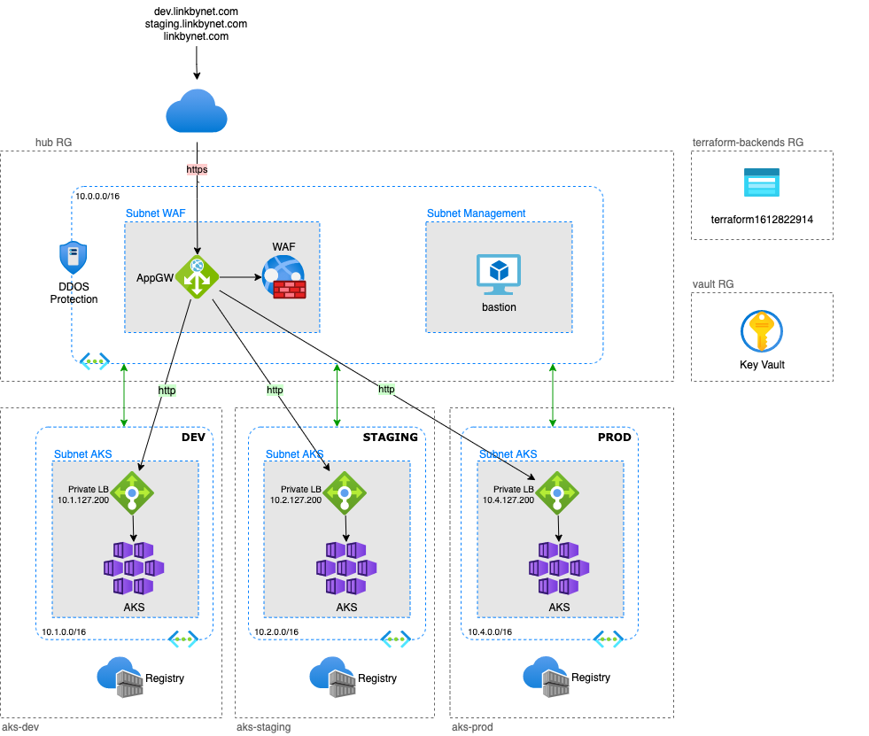

# Documentation: Setting Up the AKS Infrastructure and Deploying the Application

This guide provides a comprehensive walkthrough for setting up the Azure Kubernetes Service (AKS) infrastructure and deploying the `chat-ui` application using the provided Terraform and Kubernetes configurations.

It can be considered to use ACR to store images instead of pulling them.

In the proper solution modules would be referenced by github link instead of the path as they would be sitting in the separte repository.

There is no HTTPS now as well as DNS to resolve the address. In this scenario we are using only IP from ingress. For TLS we would need to obtain an SSL/TLS certificate and then configure it within the resource's settings.

The final goal if that would be a production running application to have it in secure way with hub-spoke architecture where traffic would go in hub over WAF and traffic inspection. Also the spokes would not have the access to the internet, it would be only accessible via hub. Therefore other folders in the folder structre to mock up the setup.  
Example picture here:


*NOTE*: Interesting comments on many bugs I encountered with Azure during this setup.

---

## Prerequisites
Tooling:
```
azure cli
terraform
kubectl
k9s - for usage convinience
```

1. **Azure CLI**:
   - Install the [Azure CLI](https://learn.microsoft.com/en-us/cli/azure/install-azure-cli).
   - Authenticate with your Azure account:
     ```bash
     az login
     ```

2. **Terraform**:
   - Install [Terraform](https://developer.hashicorp.com/terraform/tutorials/aws-get-started/install-cli).
   - Ensure the version matches the required version in the `backend.tf` files (e.g., `azurerm` provider version `4.26.0`).

3. **kubectl**:
   - Install [kubectl](https://kubernetes.io/docs/tasks/tools/install-kubectl/).
   - Ensure it is configured to interact with the AKS cluster.

4. **Azure Subscription**:
   - Ensure you have an active Azure subscription and the necessary permissions to create resources.

5. **Docker Image**:
   - The `chat-ui` application uses the Docker image `ghcr.io/huggingface/chat-ui-db:latest`. Ensure the image is accessible.

---

## Step 1: Set up the terraform remote backend

Bootstrap the backend for terraform using tf boostrap module. Important to first comment out the backend, run it to create resources and the uncomment it and run to migrate the state:
```
terraform init -migrate-state
```
Module is used in a global folder as it touches the global configuration. It is referenced by path in base-infa though in the live env it would be pulled with a tag version from other module repository. 

## Step 2: Create a resource group
Use the module rg.module to create a Resource group in a base-infra environemnt directory.

## Step 3: Create a Network
Use the module vnet.module to create a network in a base-infra environemnt directory. There might be many vnets therefore naming convention as follows with vnet-001. Might be considered to have multi vnet approach and then have a peering between the.

## Step 4: Setup AKS
Use the module aks.module to deploy a new cluster.
Configure your conneciton to AKS for kubectl with:
```
az aks get-credentials -n <cluster_name> -g <resource_group_name>
```

## Step 5: Deploy application
```
kubectl apply -f .\app.yaml
```

## Step 6: Clean up the resources so no more costs
